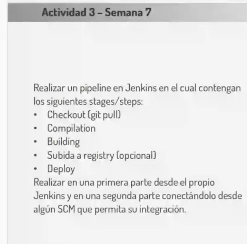

# Clase 7

## Actividad 3



* **Paso 1:** Construir una imagen llamada "myjenkins-blueocean:2.516.3-1" a partir del Dockerfile. Ir al directorio cci/docker/jenkins y ejecutar el siguiente comando:

```bash
docker build -t myjenkins-blueocean:2.516.3-1 .
```

* **Paso 2:** Ejecutamos el contenedor jenkins

```bash
docker run --name jenkins-blueocean --restart=on-failure --detach --publish 8080:8080 --publish 50000:50000 --volume jenkins-data:/var/jenkins_home --volume /var/run/docker.sock:/var/run/docker.sock --group-add $(stat -c '%g' /var/run/docker.sock) myjenkins-blueocean:2.516.3-1

```

* **Paso 3:** Desbloqueamos jenkins

```bash
sudo cat /var/lib/docker/volumes/jenkins-data/_data/secrets/initialAdminPassword
# Este comando dara un código de resultado
```
Luego ingresamos a la siguiente dirección:
> http://localhost:8080

Pegamos el código del comando anterior en el campo "Administrator password" de la pantalla "Unlock Jenkins", y posteriormente damos click en "Continue"

* **Paso 4:** Configurar Jenkins
    * En la pantalla "Customize Jenkins" seleccionar "Install suggested plugins"
    * En la siguiente pantalla definimos un usuario admin
    * En la pantalla "Instance Configuration" dejamos la configuracion actual http://localhost:8080
     

* **Paso 5:** Crear el pipeline
    * En la pantalla principal hacer click en "+ New Item"
    * Poner nombre del pipeline, seleccionar el tipo "Pipeline" y hacer click en "Ok"
    * En la siguiente pantalla seleccionamos "GitHub project", allì debemos determinar el URL del repositorio, para este caso https://github.com/francoprieto/cci.git
    * Abajo, en el apartado "Pipeline", el campo "Definition" seleccionamos la opción "Pipeline script from SCM"
    * En "SCM" seleccionamos "Git"
    * En "Repository URL" ponemos: https://github.com/francoprieto/cci.git
    * En "Branches to build" -> "Branch Specifier" poner: */main
    * En "Script Path" completar con: clase7/Jenkinsfile
    * Finalmente hacer click en "Apply" y luego "Save"

* **Paso 6:** Ejecutar y verificar pipeline
    * En la pantalla principal hacemos click sobre nuestro pipeline
    * Luego hacemos click en la opción "Build Now". Aparecerá un número de ejecución abajo.
    * Hacer click sobre el número de ejecucón 
    * Luego click sobre "Console Output" para visualizar el proceso

* **Paso 7:** Verificar despliegue
Ingrese a la siguiente dirección:
> http://localhost:9999
