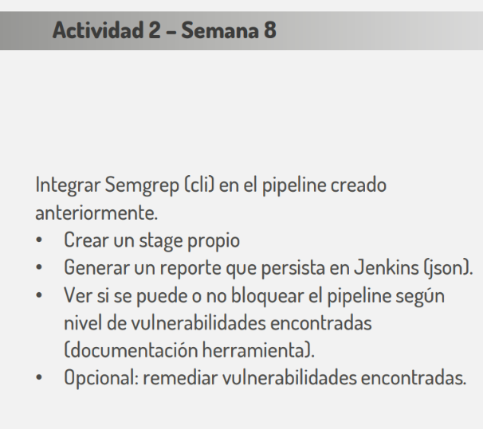
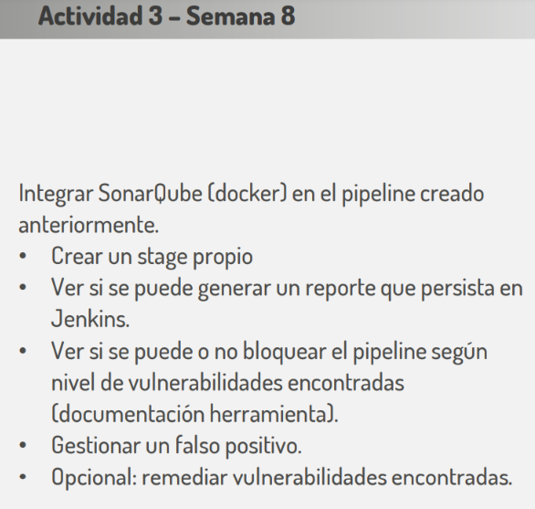

# Clase 8

## Actividad 2



### Antes de continuar, **si no se tiene instalado y configurado Jenkins** ejecutar los pasos 1 al 4 de la clase anterior  (clase7)

* **Paso 1:** Crear el pipeline en Jenkins: 
    * En la pantalla principal hacer click en "+ New Item"
    * Poner nombre del pipeline, seleccionar el tipo "Pipeline" y hacer click en "Ok"
    * En la siguiente pantalla seleccionamos "GitHub project", allì debemos determinar el URL del repositorio, para este caso https://github.com/francoprieto/cci.git
    * Abajo, en el apartado "Pipeline", el campo "Definition" seleccionamos la opción "Pipeline script from SCM"
    * En "SCM" seleccionamos "Git"
    * En "Repository URL" ponemos: https://github.com/francoprieto/cci.git
    * En "Branches to build" -> "Branch Specifier" poner: */main
    * En "Script Path" completar con: clase8/JenkinsSemgrep
    * Finalmente hacer click en "Apply" y luego "Save"

* **Paso 2:** Ejecutar y verificar pipeline
    * En la pantalla principal hacemos click sobre nuestro pipeline
    * Luego hacemos click en la opción "Build Now". Aparecerá un número de ejecución abajo.
    * Hacer click sobre el número de ejecucón 
    * Luego click sobre "Console Output" para visualizar el proceso
    * Deberia de poder descargarse el archivo "semgrep.json"

## Actividad 3



### Antes de continuar, **si no se tiene instalado y configurado Jenkins** ejecutar los pasos 1 al 4 de la clase anterior (clase7)

* **Paso 1:** Ejecutamos un contenedor con SonarQube

```bash
docker run -d --name sonarqube \
    -p 9000:9000 \
    -v sonarqube_data:/opt/sonarqube/data \
    -v sonarqube_extensions:/opt/sonarqube/extensions \
    -v sonarqube_logs:/opt/sonarqube/logs \
    sonarqube:25.10.0.114319-community
```

* **Paso 2**: Configurar sonarqube
> http://localhost:9000

* Ingresar el usuario y password admin
* Cambiar el password de admin
* En la pantalla principal hacer click en "Create a local project"
* En "Project display name" poner un nombre como "clase8-actividad3"
* En "Project key" poner un valor como "vulnerable-java-application"
* Dejar el valor que tiene el "Main branch name" y hacer click en "Next"
* En la siguiente pantalla seleccionar la opciòn "Follows the instance's default" y hacer click en "Create Project"
* En la pantalla "Analysis Method", seleccionar la opciòn "Locally"
* En la pantalla "Analyze your project", completar el "Token name" con un valor como "vulnerable-java-application" y seleccionar "No expiration". Finalmente hacer click en "Generate"
* Copiar el valor que genera, se verá parecido a esto:
> vulnerable-java-application: sqp_05b8df3eeaa7e7fcb79e651b769531925b474095
* Hacer click en "Continue" y en la pantalla "Run analysis on your project" seleccionar la opción "Other (for Go, PHP,..)"
* Copiar los valores generados que se ven como los siguientes:
>sonar-scanner \
>  -Dsonar.projectKey=vulnerable-java-application \
>  -Dsonar.sources=. \
>  -Dsonar.host.url=http://localhost:9000 \
>  -Dsonar.token=sqp_05b8df3eeaa7e7fcb79e651b769531925b474095


* **Paso 3:** Configurar Jenkins
    * En la pantalla principal, ir al la configuración (ícono de la rueda dentada alado del ícono del usuario)
    * En la pantalla "Manage Jenkins" ir a plugins, luego a "Available Plugins". Allí buscar el plugin llamado "SonarQube Scanner for Jenkins" y hacer click en "Install"
    * Una vez instalado dicho plugin (es posible que Jenkins se reinice), ir a la configuración, y luego a la opción "Credentials", luego hacer click en la opción "(global)" **que no** esta debajo de "Stores scoped to Jenkins".
    * Hacer click en "+ Add Credentials", luego seleccionar en "Kind" la opción "Secret text". En "Scope" definimos "Global (Jenkins, nodes, items, all child items, etc)", en "Secret" pegamos el valor generado en el paso anterior (para este ejemplo sería: sqp_05b8df3eeaa7e7fcb79e651b769531925b474095) y en "ID" completamos con el project key definido en el paso anterior (en este ejemplo sería: vulnerable-java-application). Finalmente hacemos click a "Create".
    * Una vez definido el "credential", ir a la configuración, y luego a la opción "Tools".
    * En la pantalla buscar la opción "SonarQube Scanner installations", y hacemos click en la lista.
    * Completamos el nombre de la herramienta, por ejemplo con "sonar-scanner", luego checkeamos la opción "Install automatically" y seleccionamos la última versión disponible. Finalmente hacemos click en "Apply" y "Save"
    * Una vez configurada la "Tool", ir a la configuración, y luego a la opción "System".
    * En la pantalla "System" buscar la opción "SonarQube Servers", habilitar el check "Environment variables", y agregar un "SonarQube installation"
    * Definir un nombre para la instalación del SonarQube (ejemplo: sonar-server), definir el URL de nuestra instalación de SonarQube (ejemplo http://sonarqube:9000) **IMPORTANTE**: El nombre del host debe conincidir con el nombre de nuestro contenedor SonarQube.
    * En "Server authentication token" seleccionamos las credenciales que hemos definido en este paso.
    * Hacemos click en "Apply" y "Save"
     

* **Paso 4:** Crear el pipeline
    * En la pantalla principal hacer click en "+ New Item"
    * Poner nombre del pipeline, seleccionar el tipo "Pipeline" y hacer click en "Ok"
    * En la siguiente pantalla seleccionamos "GitHub project", allì debemos determinar el URL del repositorio, para este caso https://github.com/francoprieto/cci.git
    * Abajo, en el apartado "Pipeline", el campo "Definition" seleccionamos la opción "Pipeline script from SCM"
    * En "SCM" seleccionamos "Git"
    * En "Repository URL" ponemos: https://github.com/francoprieto/cci.git
    * En "Branches to build", "Branch Specifier" poner: */main
    * En "Script Path" completar con: clase8/JenkinsSonar
    * Finalmente hacer click en "Apply" y luego "Save"

* **Paso 5**: Ejecutar y verificar pipeline
    * En la pantalla principal hacemos click sobre nuestro pipeline
    * Luego hacemos click en la opción "Build Now". Aparecerá un número de ejecución abajo.
    * Hacer click sobre el número de ejecucón 
    * Luego click sobre "Console Output" para visualizar el proceso

* **Paso 6**: Verificar despliegue
Ingrese a su instalación de SonarQube y verifique si se encuentra el resultado del análisis

